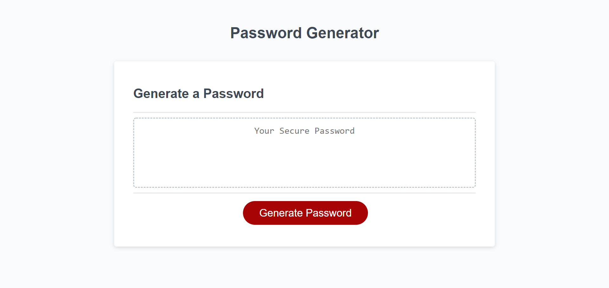

# PasswordGeneratorChallenge03
## Table of contents
* [General info](#general-info)
* [Website Link](#website-link)
* [Screenshot](#screenshot)

## General info
This application will run in the browser and employee can use to generate a random password based on criteria they've selected.Its developed using HTML ,CSS and JavaScript
    

## Changes

* Included the Logic to prompt for the length of the password
* Added logic to validate and accept only numeric value in the range of 8-128 and if the user type any number that are not within the range,then it will prompt again for the length of the password
* Added logic to confirm whether or not to include lowercase, uppercase, numeric, and/or special characters
* Added logic to verify if the user select atleast one criteria,if not reask the criteria questions
* Added logic for generating a random password with character set
* Added logic to show the generated password on the textarea

## Website Link

> Live link [https://maharjn.github.io/PasswordGeneratorChallenge03/]

## Screenshot
The following image shows the web application's appearance and functionality:

